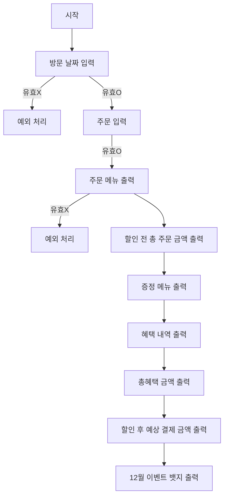

# 📚 WOOWAPRECOURCE ASSIGNMENT

# 🎅 크리스마스 프로모션

## 📜 기능 요구사항

### 식당 방문 일자를 입력받는 기능

- [x] 방문할 날짜는 1 이상 31 이하의 숫자만 입력할 수 있다.
  - [x] 방문하는 날짜가 범위에 해당하지 않는다면 예외처리한다.
  - [x] 방문하는 날짜가 숫자가 아니라면 예외처리한다.
  - [x] 방문하는 날짜가 정수가 아니라면 예외처리한다.
- [x] 에러 메시지는 다음과 같다.
  - **[ERROR] 유효하지 않은 날짜입니다. 다시 입력해 주세요.**

### 주문할 메뉴의 이름과 개수를 입력받는 기능

- [x] 고객은 반드시 메뉴판에 존재하는 메뉴만 입력해야한다.
  - [x] 메뉴판에 존재하지 않는 메뉴를 주문한다면 예외처리한다.
- [x] 메뉴의 개수는 반드시 1 이상의 숫자를 입력해야한다.
  - [x] 유효하지 않은 숫자를 입력한다면 예외처리한다.
- [x] 메뉴 형식은 다음과 같다.
  - **시저샐러드-1,티본스테이크-1,크리스마스파스타-1,제로콜라-3,아이스크림-1**
  - [x] 메뉴 형식이 예시와 다르다면 예외처리한다.
  - [x] 중복 메뉴를 입력할 경우 예외처리한다.
  - [x] 메뉴 개수의 총합이 20 초과라면 예외처리한다.
- [x] 에러 메시지는 다음과 같다.
  - **[ERROR] 유효하지 않은 주문입니다. 다시 입력해 주세요.**
- [x] 주문한 메뉴가 모두 음료라면 예외처리하며, 에러 메시지는 다음으로 한다.
  - **[ERROR] 음료만 주문할 수 없습니다. 다시 입력해 주세요.**

### 주문한 메뉴를 출력하는 기능

- [x] 주문한 메뉴를 한 줄에 하나씩 출력해야한다.
- [x] 출력은 다음과 같다.
  - **티본스테이크 1개**

### 주문한 메뉴의 합계액을 출력하는 기능

- [x] 주문한 메뉴들의 할인전 총 금액을 출력해야한다.
- [x] 출력은 다음과 같다.
  - **142,000원**
  - [x] 금액은 천원 단위로 쉼표를 나타내야한다.

### 증정 메뉴를 출력하는 기능

- [x] 이벤트에 해당하는 증정메뉴의 유무를 출력해야한다.
- [x] 출력은 다음과 같다.
  - **샴페인 1개**
  - [x] 할인 전 총주문금액이 120,000 이상이라면 샴페인 1개를 증정한다.
  - [x] 해당사항이 없다면 **없음**을 출력한다.

### 혜택 내역을 출력하는 기능

- [x] 입력받은 날짜에 해당하는 이벤트 리스트 내역과 할인액을 출력해야한다.
- [x] 출력은 다음과 같다.
  - **크리스마스 디데이 할인: -1,200원**
  - [x] 금액은 천원 단위로 쉼표를 나타내야한다.
  - [x] 크리스마스 디데이 할인은 크리스마스가 다가올수록 100원씩 증가해야한다.
  - [x] 평일(일요일 ~ 목요일)에는 디저트 메뉴를 메뉴 1개당 2,023원 할인한다.
  - [x] 주말(금요일 ~ 토요일)에는 메인 메뉴를 메뉴 1개당 2,023원 할인한다.
  - [x] 이벤트 달력에 별이 있으면 총주문금액에서 1,000원 할인한다.
  - [x] **크리스마스 디데이 할인**이벤트는 2023. 12. 1. ~ 2023. 12. 25.까지 적용한다.
  - [x] **크리스마스 디데이 할인**을 제외한 다른 이벤트는 2023. 12. 1. ~ 2023. 12. 31.까지 적용한다.
  - [x] 해당사항이 없다면 **없음**을 출력한다.

### 총혜택금액을 출력하는 기능

- [x] 총 할인 금액을 출력해야한다.
- [x] 출력은 다음과 같다.
  - **-31,246원**
  - [x] 금액은 천원 단위로 쉼표를 나타내야한다.
  - [x] 총혜택금액은 할인 금액의 합계 + 증정 메뉴의 가격으로 나타낸다.

### 할인 후 예상 결제 금액을 출력하는 기능

- [x] 할인 후 금액을 출력해야한다.
- [x] 출력은 다음과 같다.
  - **8,500원**
  - [x] 금액은 천원 단위로 수미표를 나타내야한다.
  - [x] 할인 후 예상 결제 금액은 할인 전 총주문 금액 - 할인 금액으로 나타낸다.

### 12월 이벤트 뱃지를 출력하는 기능

- [x] 해당하는 이벤트 뱃지를 출력한다.
- [x] 출력은 다음과 같다.
  - **산타**
  - [x] 5천원 이상은 별, 1만원 이상은 트리, 2만원 이상이라면 산타를 출력한다.
  - [x] 해당사항이 없다면 **없음**을 출력한다.

### 예외 처리

- [x] 사용자가 잘못된 값을 입력할 경우 throw문을 사용해 예외를 발생시키고, "[ERROR]"로 시작하는 에러 메시지를 출력 후 해당 부분부터 재시작한다.

### ❗ 유의사항

- [x] package.json을 변경할 수 없고 외부 라이브러리(jQuery, Lodash 등)를 사용하지 않는다. 순수 Vanilla JS로만 구현한다.
- [x] JavaScript 코드 컨벤션을 지키면서 프로그래밍 한다
- [x] 프로그램 종료 시 process.exit()를 호출하지 않는다.
- [x] 프로그램 구현이 완료되면 ApplicationTest의 모든 테스트가 성공해야 한다. 테스트가 실패할 경우 0점 처리한다.
      프로그래밍 요구 사항에서 달리 명시하지 않는 한 파일, 패키지 이름을 수정하거나 이동하지 않는다.
- [x] indent(인덴트, 들여쓰기) depth를 3이 넘지 않도록 구현한다. 2까지만 허용한다.
  - 예를 들어 while문 안에 if문이 있으면 들여쓰기는 2이다.
  - 힌트: indent(인덴트, 들여쓰기) depth를 줄이는 좋은 방법은 함수(또는 메서드)를 분리하면 된다.
- [x] Jest를 이용하여 본인이 정리한 기능 목록이 정상 동작함을 테스트 코드로 확인한다.
- [x] 함수(또는 메서드)의 길이가 15라인을 넘어가지 않도록 구현한다.
- [x] 함수(또는 메서드)가 한 가지 일만 하도록 최대한 작게 만들어라.
- [x] else를 지양한다.
  - 힌트: if 조건절에서 값을 return하는 방식으로 구현하면 else를 사용하지 않아도 된다.
  - 때로는 if/else, switch문을 사용하는 것이 더 깔끔해 보일 수 있다. 어느 경우에 쓰는 것이 적절할지 스스로 고민해 본다.
- [x] 도메인 로직에 단위 테스트를 구현해야 한다. 단, UI(Console.readLineAsync, Console.print) 로직에 대한 단위 테스트는 제외한다.
- [x] 핵심 로직을 구현하는 코드와 UI를 담당하는 로직을 구분한다.
- [x] 사용자가 잘못된 값을 입력할 경우 throw문을 사용해 예외를 발생시킨다. 그런 다음, "[ERROR]"로 시작하는 에러 메시지를 출력하고 해당 부분부터 입력을 다시 받는다.

## 🌊 플로우 차트



## 🗂️ 폴더 구조

```
📦src
┣ 📂constants
┃ ┣ 📜Calendar.js
┃ ┣ 📜ChristmasEventMessage.js
┃ ┣ 📜ChristmasEventOption.js
┃ ┣ 📜DecemberEventList.js
┃ ┣ 📜Dish.js
┃ ┗ 📜Symbol.js
┣ 📂controller
┃ ┗ 📜ChristmasEventController.js
┣ 📂domain
┃ ┣ 📜DecemberEvent.js
┃ ┣ 📜MonthlyEvent.js
┃ ┗ 📜OrderSheet.js
┣ 📂error
┃ ┣ 📜DefaultError.js
┃ ┗ 📜ValidationError.js
┣ 📂service
┃ ┣ 📜ChristmasEventService.js
┃ ┗ 📜ChristmasOrderService.js
┣ 📂utils
┃ ┣ 📜deepFreeze.js
┃ ┣ 📜getItemInformationByItemName.js
┃ ┣ 📜getItemKindByOrderList.js
┃ ┣ 📜isWeekend.js
┃ ┗ 📜JSDocs.js
┣ 📂validator
┃ ┣ 📜OrderValidator.js
┃ ┗ 📜VisitDayValidator.js
┣ 📜App.js
┣ 📜index.js
┣ 📜InputView.js
┗ 📜OutputView.js
```
