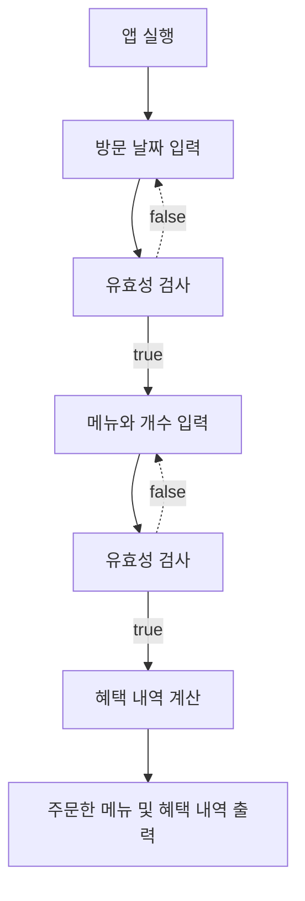

# 🚀 기능 요구사항 반영

보낸 사람: 개발팀 <dev@woowacourse.io>  
받는 사람: 비즈니스팀 <biz@woowacourse.io>

제목: 12월 이벤트 플래너 개발 완료

안녕하세요 개발팀입니다.

요청해주신 "12월 이벤트 플래너" 개발을 완료하였습니다.

예산확보가 많이 되었으나 인력 충원이 되지 않아 오직 저 혼자 개발하여 미흡한 점이 있지만 요청하신 기능이 정상적으로 동작하도록 최대한 만들어 보았습니다.

먼저 전체적인 시연은 아래와 같습니다.

### 🖥️ 적용된 이벤트가 하나도 없는 경우


### 🖥️ 적용되는 이벤트가 있는 경우


## 🎯 요청 사항 반영 사항

12월 이벤트 계획 반영사항입니다.

크리스마스 디데이 할인을 제외한 다른 이벤트는 2023.12.1~ 2023.12.31 까지입니다.

- [x] 크리스마스 디데이 할인 (2023.12.1 ~ 2023.12.25)
- [x] 평일 할인
- [x] 주말 할인
- [x] 특별 할인
- [x] 증정 이벤트

### 1️⃣ 혜택 금액에 따른 12월 이벤트 배지 부여

총혜택 금액에 따라 다른 이벤트 배지를 부여하도록 개발하였습니다.

#### 🥎 5천원 미만 : `없음`

<details>
<summary>예시</summary>

<!-- summary 아래 한칸 공백 두어야함 -->

</details>

#### 🥎 5천원 이상 : `별`

<details>
<summary>예시</summary>

<!-- summary 아래 한칸 공백 두어야함 -->

</details>

#### 🥎 1만원 이상 : `트리`

<details>
<summary>예시</summary>

<!-- summary 아래 한칸 공백 두어야함 -->

</details>

#### 🥎 2만원 이상 : `산타`

<details>
<summary>예시</summary>

<!-- summary 아래 한칸 공백 두어야함 -->

</details>

### 2️⃣ 고객에게 안내할 이벤트 주의사항은 주문전에 출력되도록 하여 환기할 수 있도록 하였습니다.

<details>
<summary>예시</summary>

<!-- summary 아래 한칸 공백 두어야함 -->

</details>

### 3️⃣ 방문 날짜 관련

#### 🥎 방문할 날짜가 1이상 31이하 숫자가 아닌경우 `[ERROR] 유효하지 않은 날짜입니다. 다시 입력해 주세요.` 를 출력하도록 하였습니다.

<details>
<summary>예시</summary>

<!-- summary 아래 한칸 공백 두어야함 -->

</details>

### 4️⃣ 주문 메뉴 관련

#### 🥎 고객이 메뉴판에 없는 메뉴를 입력하였을 경우 `[ERROR] 유효하지 않은 주문입니다. 다시 입력해 주세요.`라는 에러 메시지를 출력하도록 하였습니다.

<details>
<summary>예시</summary>

<!-- summary 아래 한칸 공백 두어야함 -->

</details>

#### 🥎 메뉴의 개수가 1미만 20을 초과하는 숫자를 입력하였을 경우 `[ERROR] 유효하지 않은 주문입니다. 다시 입력해 주세요.`라는 에러 메시지를 출력하도록 하였습니다.

<details>
<summary>예시</summary>

<!-- summary 아래 한칸 공백 두어야함 -->

</details>

#### 🥎 메뉴 형식이 예시와 다른 경우, `[ERROR] 유효하지 않은 주문입니다. 다시 입력해 주세요.`라는 에러 메시지를 출력하도록 하였습니다.

<details>
<summary>예시</summary>

<!-- summary 아래 한칸 공백 두어야함 -->

</details>

#### 🥎 중복 메뉴를 입력한 경우(e.g. 시저샐러드-1,시저샐러드-1), `[ERROR] 유효하지 않은 주문입니다. 다시 입력해 주세요.`라는 에러 메시지를 출력하도록 하였습니다.

<details>
<summary>예시</summary>

<!-- summary 아래 한칸 공백 두어야함 -->

</details>

### 5️⃣ 혜택 내역 출력 관련

#### 🥎 주문 메뉴의 출력 순서는 따로 요청하지 않으셔서 입력한 순서대로 출력되게 하였습니다.

<details>
<summary>예시</summary>

<!-- summary 아래 한칸 공백 두어야함 -->

</details>

#### 🥎 `총혜택 금액`은 `할인 금액의 합계` + `증정 메뉴의 가격`으로 설정하였고 `할인 후 예상 결제 금액`은 `할인 전 총주문 금액` - `할인 금액`으로 설정하였습니다.

<details>
<summary>예시</summary>

<!-- summary 아래 한칸 공백 두어야함 -->

</details>

#### 🥎 증정 이벤트에 해당하지 않는 경우, 증정 메뉴 `없음`을 출력하도록 하였습니다.

<details>
<summary>예시</summary>

<!-- summary 아래 한칸 공백 두어야함 -->

</details>

#### 🥎 고객에게 혜택 낵역을 보여줄 때 적용된 이벤트 내역만 보여주도록 하였고 만약 적용된 이벤트가 없다면 `없음`으로 보여주도록 하였습니다. (출력 순서는 따로 요청사항이 없으셔서 `디데이 할인`, `평일(주말) 할인`, `특별 할인`, `증정 이벤트` 순입니다.)

<details>
<summary>예시</summary>

<!-- summary 아래 한칸 공백 두어야함 -->


</details>

<br>

추가적인 할인 혜택을 추가 또는 제거하기 유연하도록 구현하여 더 좋은 의견있으면 언제든지 말씀해주세요. 그리고 이벤트 목표중 하나가 12 이벤트 참여 고객 일부가 내년 1월 새해 이벤트에 재참여하는 것이라고 하셨는데 이와 유사한 이벤트라면 몇개의 상수만 교체하면 바로 1월 이벤트에 사용가능하도록 구현하였습니다.

직접 시연해보시고 의견 주시면 감사합니다.

<br>

# 기능 목록

## 개요

1. 고객에게 12월 중 식당 예상 방문 날짜를 입력 받는다
2. 고객이 원하는 메뉴와 개수를 입력받는다.
3. 혜택 내용을 출력한다. (아래내용 모두 포함)
   - 주문 메뉴를 출력한다.
   - 할인 전 총 주문 금액을 출력한다.
   - 증정 메뉴를 출력한다.
   - 혜택 내역을 출력한다.
   - 총혜택 금액을 출력한다.
   - 할인 후 예상 결제 금액을 출력한다.
   - 12월 이벤트 배지를 출력한다.

## 기능 목록 리스트

### 1. 고객에게 12월 중 식당 예상 방문 날짜를 입력 받는다

- [x] 식당 방문 날짜를 입력 받는다.
- [x] 빈문자열이 있는지 확인한다. (view에서 적어도 무언가 값을 받오기는 해야함, 유효성검사는 모델에서)
- 유효성 검사를 한다. (1~31이하의 숫자로만 입력 받는다.)
  - [예외] 숫자 외의 문자가 포함되었을 경우 (주의❗️ : "[ERROR] 유효하지 않은 날짜입니다. 다시 입력해 주세요."라는 에러 메시지를 보여 주세요.")
  - [예외] 정수가 아닐 경우 (주의❗️ : "[ERROR] 유효하지 않은 날짜입니다. 다시 입력해 주세요."라는 에러 메시지를 보여 주세요.")
  - [예외] 숫자가 1미만 31초과일 경우 (주의❗️ : "[ERROR] 유효하지 않은 날짜입니다. 다시 입력해 주세요."라는 에러 메시지를 보여 주세요.")
- [x] (추가) 에러 발생시 에러메시지를 출력하고 다시 식당 방문 날짜를 입력 받는다.

### 2. 고객이 원하는 메뉴와 개수를 입력 받는다

- [x] 고객이 원하는 메뉴와 개수를 입력 받는다.
- [x] 빈문자열이 있는지 확인한다.
- 유효성 검사를 한다. (수정 : 현재 유효성체크 다시 설계 해야함)

  - [x] [예외] 한글,-,숫자 외의 문자가 포함되었을 경우 (주의 ❗️ : [ERROR] 유효하지 않은 주문입니다. 다시 입력해 주세요.")
  - [x] [예외] 한 메뉴에 1 미만, 20을 초과하는 숫자를 입력하였을 때 (주의 ❗️ : "[ERROR] 유효하지 않은 주문입니다. 다시 입력해 주세요.")
  - [x] [예외] 메뉴판에 없는 메뉴일 경우 (주의 ❗️ : "[ERROR] 유효하지 않은 주문입니다. 다시 입력해 주세요.") (추가 :메시지 보내기)
  - [x] [예외] 음료만 주문하였을 경우 (추가: 메시지 보내기)
  - [x] [예외] 중복 메뉴를 입력한 경우 (주의 ❗️ : [ERROR] 유효하지 않은 주문입니다. 다시 입력해 주세요.")
  - [x] [예외] 메뉴 주문 개수가 총 20개를 초과할 경우

- [x] (수정) 고객이 입력한 주문 메뉴들을 정리해서 저장한다.

### 3. 혜택 내용을 출력한다

    - 일단 출력은 하나씩 하고 마지막에 리팩터링 해서 한 번에 출력( 각 객체별로 분산 )
    - [x] 주문 메뉴 출력 (주문 객체)
    - [x] (수정) 할인 전 총주문 금액 출력
    - [x] 할인전 총 주문금액이 12만원이 넘을 시 샴페인 증정
    - [x] 혜택 계산하기 (총 주문 금액 10,000원 이상부터 적용)
    - [x] (수정)혜택 내역 출력하기
    - [x] (수정)총혜택 금액 계산하기
    - [x] (수정)총혜택 금액 출력하기
    - [x] 할인 후 예상 결제 금액 계산
    - [x] 할인 후 예상 결제 금액 출력
    - [x] 12월 이벤트 배지 출력

### 내가 생각하는 예시

```text
안녕하세요! 우테코 식당 12월 이벤트 플래너입니다.


12월 중 식당 예상 방문 날짜는 언제인가요? (숫자만 입력해 주세요!)
3

❗️ 주문 관련 안내사항
총주문 금액 10,000원 이상부터 이벤트가 적용됩니다.
음료만 주문 시, 주문할 수 없습니다.
메뉴는 한 번에 최대 20개까지만 주문할 수 있습니다.

주문하실 메뉴를 메뉴와 개수를 알려 주세요. (e.g. 해산물파스타-2,레드와인-1,초코케이크-1)
티본스테이크-1,바비큐립-1,초코케이크-2,제로콜라-1
12월 3일에 우테코 식당에서 받을 이벤트 혜택 미리 보기!

<주문 메뉴>
티본스테이크 1개
바비큐립 1개
초코케이크 2개
제로콜라 1개

<할인 전 총주문 금액>
142,000원

<증정 메뉴>
샴페인 1개

<혜택 내역>
크리스마스 디데이 할인: -1,200원
평일 할인: -4,046원
특별 할인: -1,000원
증정 이벤트: -25,000원

<총혜택 금액>
-31,246원

<할인 후 예상 결제 금액>
135,754원

<12월 이벤트 배지>
산타
```

<br>

### 🥎 플로우 차트



<br>

### 💎 객체 설계도


<br>

### 💻 테스트 커버리지


### 처음 설계할 때 했던 생각

2번의 입력 값을 받고 다양한 내용들을 출력해야한다. 객체지향적으로 생각해서 출력해야하는 각 내용별로 객체를 통해 관리하면 좋을 것 같다.

예를들면

- 주문 메뉴를 관리하는 객체
- 할인 전 총 주문 금액을 관리하는 객체,
- 증정 이벤트 판단 메서드를 가지고있는 객체
- 혜택을 관리하는 객체
  - 크리스마스 디에이 할인 관리 객체 콜
  - 평일 할인 / 특별 할인 객체 콜
  - 증정 이벤트 콜
  - 총혜택 금액 = 혜택 내역 (총 혜택 가격을 저장하고 있어야겠다)
- 할인 후 예상 결제 금액
  - 할인 전 총 주문 금액 - 총 혜택 금액 (둘중 하나 get으로 데이터 가져와서 다른 한곳에 메시지보내서 결과값 가져오기)
- 12월 이벤트 배지
  - 총혜택 금액 콜 메시지 보내서 별 or 트리 or 산타를 결과값을 받아오삼
